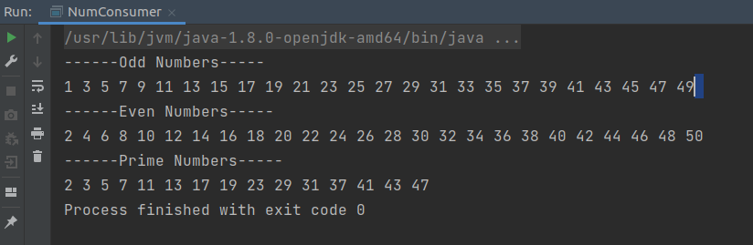

# machnet-backend
This repository includes all the backend assigments of machnet intership.

Question 1--->
Write  different consumers to print odd/even/prime numbers from 1 to 50.

Output:

Question 2--->
Write a supplier which gives two digit random prime numbers.

Question 3--->
Create a functional interface named Shape which contains a method calculateArea. Using this functional interface, calculate the area of rectangle and triangle.

Question 4--->
Create an array list containing the names of people. Using predicate, find the name that starts with “a” or “A” and contains length no more than 5.

Question 5--->
Generate random integers of size 100 and sort them using stream API in descending order.

