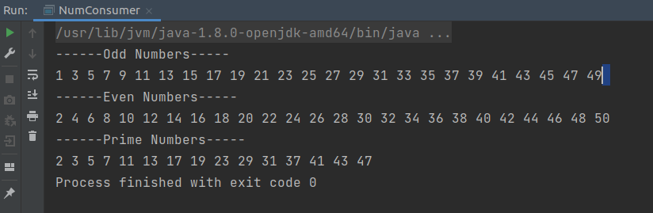
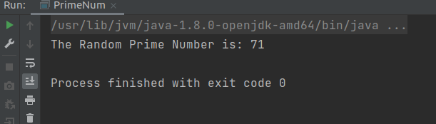
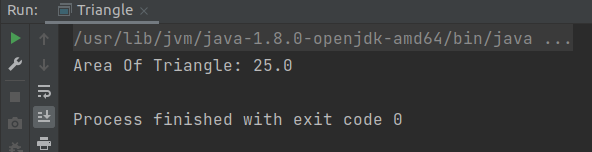
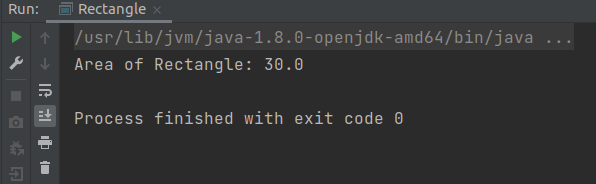
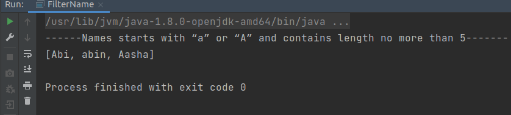
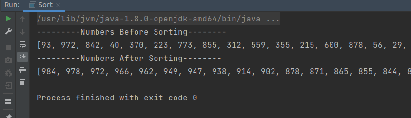

# machnet-backend(Assignment-3)
This branch includes all the tasks of assigment 3.

Question 1--->
<b>Write  different consumers to print odd/even/prime numbers from 1 to 50.</b>

Output:

Question 2--->
<b>Write a supplier which gives two digit random prime numbers.</b>

Output:

Question 3--->
<b>Create a functional interface named Shape which contains a method calculateArea. Using this functional interface, calculate the area of rectangle and triangle.</b>

Output:

Question 4--->
<b>Create an array list containing the names of people. Using predicate, find the name that starts with “a” or “A” and contains length no more than 5.</b>

Output:

Question 5--->
<b>Generate random integers of size 100 and sort them using stream API in descending order.</b>

Output:

